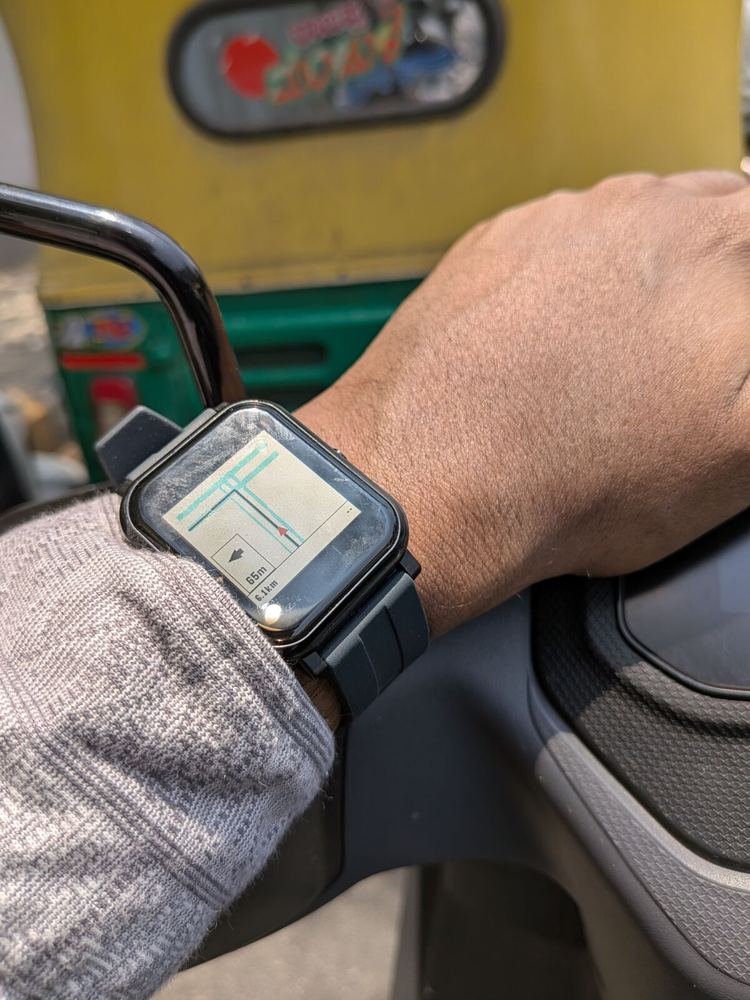

# PebbleMaps

Turn-by-turn navigation on your Pebble smartwatch, powered by your Android phone.

<p align="center">
  
</p>

## Features

- **Turn-by-turn navigation** with directional arrows and distance to next turn
- **Live map rendering** with roads, buildings, parks, and water features
- **Route overview** showing your path and destination
- **Zoom control** using the Up/Down buttons on the watch
- **Remaining distance and ETA** displayed in the bottom bar
- **Street name display** for upcoming turns
- **Bridge and tunnel rendering** with distinct visual styles
- Supports **multiple Pebble platforms** — dynamically adapts to different screen sizes (Pebble Time, Pebble Time Round, etc.)
- Works with **OSM-based** routing — no API keys required

## Download

### Pebble Watchapp

Available on the **Pebble App Store** — search for "Pebble Maps Nav".

### Android Companion

| Source | Link |
|--------|------|
| F-Droid | *Coming soon* |
| GitHub Releases | [Latest Release](../../releases) |

## How It Works

PebbleMaps consists of two parts:

1. **Android app** — Handles GPS tracking, map data fetching (from OpenStreetMap vector tiles), route calculation, and prepares optimized map frames for the watch.
2. **Pebble watchapp** — Receives map frames over Bluetooth and renders the navigation view: roads, route line, turn indicators, distance, and ETA.

The watch sends its screen dimensions to the phone, so the map data is always tailored to the exact display size — no hardcoded assumptions.

### Supported Watches

The watchapp builds for multiple Pebble platforms:

| Platform | Display | Color |
|----------|---------|-------|
| Basalt (Pebble Time) | 144×168 | Color |
| Diorite (Pebble 2) | 144×168 | Black & White |
| Emery (Rebble SDK) | 200×228 | Color |

## Building from Source

### Android App

Requirements:
- Android Studio
- Android SDK 34
- JDK 17

```bash
./gradlew assembleDebug
```

The APK will be at `android/build/outputs/apk/debug/`.

### Pebble Watchapp

Requirements:
- [Pebble SDK](https://developer.rebble.io/developer.pebble.com/sdk/index.html) (via Rebble)

```bash
cd pebble-watchapp
pebble build
```

For a specific platform:

```bash
pebble build --platform basalt
```

## Architecture

```
pebblemaps/
├── android/                  # Android companion app (Kotlin + Jetpack Compose)
│   └── src/main/java/
│       └── com/pebblemaps/android/
│           ├── data/         # Pebble communication, map tile fetching
│           ├── domain/model/ # Data models (routes, roads, features)
│           ├── ui/           # Compose UI (map, navigation, watch preview)
│           └── util/         # Geometry preparation, coordinate transforms
├── pebble-watchapp/          # Pebble C watchapp
│   ├── src/c/main.c          # Rendering, AppMessage protocol, input handling
│   ├── resources/            # Turn arrow bitmaps
│   └── package.json          # App metadata and message key definitions
└── docs/
    └── screenshot.jpg
```

## License

This project is open source. See the [LICENSE](LICENSE) file for details.
